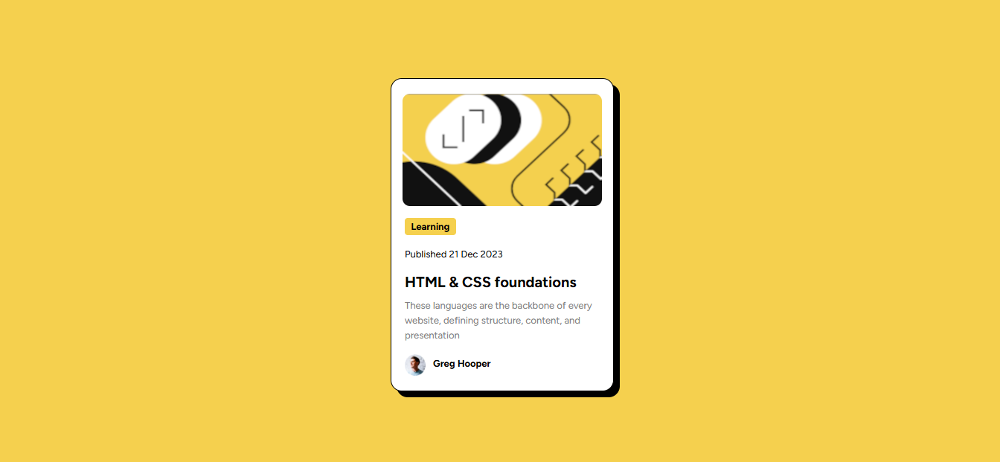

# Frontend Mentor - Blog Preview Card

This is a solution to the [Social links profile challenge on Frontend Mentor](https://www.frontendmentor.io/challenges/blog-preview-card-ckPaj01IcS).  
Frontend Mentor challenges help you improve your coding skills by building realistic projects.

---

## 📸 Screenshot



---

## 🔗 Links

- **Solution URL:** [https://www.frontendmentor.io/solutions/blog-preview-card-zmrCyy_2uz](#)
- **Live Site URL:** [https://fransantos103.github.io/frontendMentorEasy-blog-preview-card/](#)

---

## 💻 My process

### Built with
- Semantic **HTML5** markup  
- **CSS3** (Flexbox, hover states, custom fonts)  
- Responsive design principles  

---

## 🧠 What I learned

While working on this project, I reinforced my understanding of:
- Using **semantic HTML** (`<main>`)
- Creating **centered layouts** with Flexbox  
- Designing **consistent color palettes and hover effects**

Here’s a little code snippet I’m proud of:
```css

body{
  background-color: #f5d04e;
  display: flex;
  justify-content: center;
  align-items: center;
  min-height: 100dvh; 
  overflow-x: hidden; 
}

